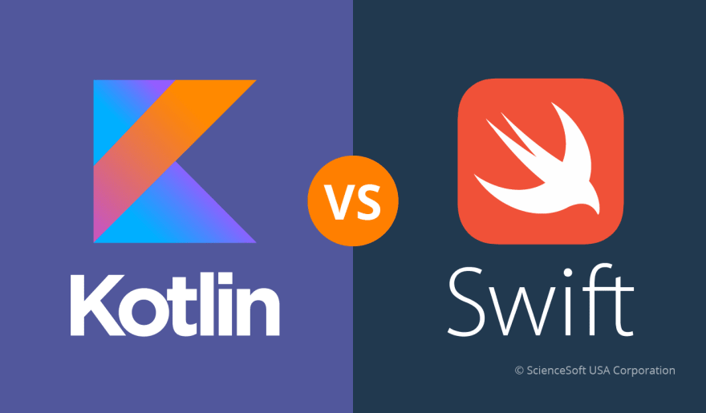
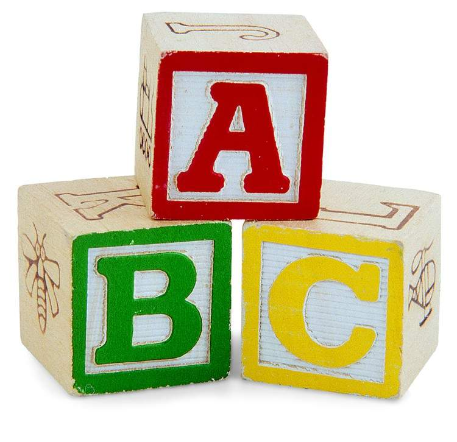

name: heading
layout: true
class: center, middle, inverse

---

name: inverse
layout: true
class: middle, inverse

---

template: heading


# val kotlin: Introduction
Slides - [github.com/chrisdail/talk-kotlin-intro](https://github.com/chrisdail/talk-kotlin-intro)

Chris Dail - [@chrisdail](http://twitter.com/chrisdail)

Senior Director, Software Engineering


---

template: heading
# Kotlin

---

template: heading
# Fastest Growing Programming Language

---

template: heading
# PYPL - [pypl.github.io](pypl.github.io/)


---

template: heading
# StackOverflow


---

template: heading
# But Why?

---

template: heading
# Google IO 2017


---

# Why Kotlin?

From The Authors:

> "We want to become more productive by switching to a more expressive language. At the same time, we cannot accept compromises in terms of either Java interoperability or compilation speed." - JetBrains Blog

---

# Kotlin Is

- General purpose programming language
- Open Source (Apache 2)
- Statically Typed
- Concise, safe, pragmatic
- Interoperable

---

template: heading

# Kotlin Myths

Misconceptions about the language

---

template: heading


# Kotlin is Google's answer to Apple's Swift

--

Kotlin started in 2011 by JetBrains with 1.0 in 2016

Android support was only announced in 2017

---

template: heading


# Kotlin is a Swift Clone

--

Swift started in 2010 but Apple only announced it in 2014

---

template: heading


# Kotlin is only for Java Developers

--

Kotlin is a modern, pragmatic language with excellent interop

Initially meant JVM but now extends to JavaScript and Native

---

template: heading

# Kotlin offers little over Java 8/9

--

Steams and Lambdas a great but were only part of the issues

Don't take my word for it...

---

layout: false

# Kotlin Is...

- Object Oriented

```kotlin
class Square(val length: Double) {
    fun area() = length.pow(2)
}
println(Square(2.0).area())
```

--
- Procedural

```kotlin
fun areaOfSquare(length: Double) = length.pow(2)
println(areaOfSquare(2.0))
```

--
- Functional

```kotlin
println(listOf(2.0).map(::areaOfSquare).first())
```

---

template: heading


# Basics

---

layout: false

# Creating Variables

- Variables require initialization

```kotlin
var message: String = "Hello World!"
```

--
- Inferred Types

```kotlin
var message = "Hello World!"
```

--
- Immutable is preferable

```kotlin
val message = "Hello World Forever!"
```

---

# Strings

- Interpolation

```kotlin
var planet = "Earth"
println("Hello $planet")
println("HELLO ${planet.toUpperCase()}")
```

- Multiline

```kotlin
var multilineString = """
    |{
    |    "message": "test"
    |}
""".trimMargin()
println(multilineString)
```

---

# Nulls

- `Any` - All classes extend from Any

--
- `Any?` - Nullable Type

```kotlin
var neverNull: String = "hi"
//neverNull = null   // Compilation Error
var message: String? = "hi"
message = null
```

--
- `?.` - Null-safe calls

```kotlin
//message.length   // Compilation Error
message?.length
// Equivalent Java: (message == null) ? null : message.length
```

---

template: heading


# Elvis Operator

---

# `?:` - Elvis Operator

- Returns left if not null, otherwise right

```kotlin
val length = message?.length ?: -1
```

- Can be combined with `throw` or `return`

```kotlin
val map = mapOf("name" to "Ivy")
val name = map["name"] ?: throw IllegalArgumentException()
```

---

# Destructuring

- Assigning multiple values

```kotlin
val (last, first) = "Bond, James".split(", ")
println("$last. $first $last.")

// Bond. James Bond.
```

- `_` - Unused Parameter

```kotlin
val (_, prefix, suffix) = "506-555-1212".split("-")
println("Making Local call to $prefix-$suffix")

// Making Local call to 555-1212
```

---

template: heading


# Control Flow

---

# If / Else

- Traditional

```kotlin
var max: Int
if (a > b) {
    max = a
} else {
    max = b
}
```

- As Expression

```kotlin
val max = if (a > b) a else b
```

---

# When

- Switch-like

```kotlin
when (x) {
    -1 -> println("INVALID")
    0, 1 -> println("0 or 1")
    in 2..100 -> println("x == $x")
    else -> println("otherwise")
}
```

- if-else chain

```kotlin
when {
    x.isOdd() -> print("x is odd")
    x.isEven() -> print("x is even")
    else -> print("x is funny")
}
```

---

# When

- Also an expression
- Smart Casts

```kotlin
println(when (x) {
    is Int -> x + 1
    is String -> x.length + 1
    is IntArray -> x.sum()
})
```

---

# For

- Loop over list

```kotlin
for (value in ints) {
    println(value)
}
```

- With Ranges

```kotlin
for (i in 1..3) {
    println(i)
}
```

---

# Putting it all together

- Fizz Buzz

```kotlin
for (n in 1..100) {
    println(when {
        n % 15 == 0 -> "FizzBuzz"
        n % 3 == 0 -> "Fizz"
        n % 5 == 0 -> "Buzz"
        else -> n
    })
}
```

---

template: heading


# Functions

---

# Functions

- No class required
- Simple function

```kotlin
fun reverse(message: String): String {
    return message.reversed()
}
println(reverse("Hello World"))

// dlroW olleH
```

- One Liner

```kotlin
fun add(a: Int, b: Int) = a + b
println(add(1, 1))

// 2
```

---

# Arguments

- Default/Optional Arguments

```kotlin
fun addUser(name: String, city: String = "Moncton", province: 
        String = "NB", country: String = "Canada") {
    // ...
}

addUser("Charlie")
```

- Named Arguments

```kotlin
addUser("Charlie", province = "NS", city = "Halifax")
```

---

# Lambdas / Closures

- Last line is the returned value
```kotlin
val sum = { x: Int, y: Int -> 
        x + y
}
```
- Higher Order Functions
```kotlin
val diff = { x: Int, y: Int -> x - y }
fun eval(x: Int, y: Int, binaryOp: (Int,Int) -> Int): Int {
        return binaryOp(x, y)
}
println(eval(2, 1, sum))
// 3
println(eval(2, 1, diff))
// 1
```

---

template: heading


# Classes

---

# Class

- Simple Constructor with init block
```kotlin
class Person(name: String) {
        init {
            println("Created person with $name")
        }
}
```

- Class with properties
```kotlin
class User(var name: String, var age: Int)
val user = User("Charlie", 20)
println("Created user: ${user.name} age: ${user.age}")
```

---

# Inheritance

```kotlin
open class Base(val p: Int)

class Derived(p: Int) : Base(p) {
    override fun toString() = "I have p = $p"
}
```

---

# Properties

- Basic declaration
```kotlin
class Address {
        var name: String = ""
        var street: String = ""
        var city: String = ""
        var state: String? = null
        var zip: String = ""
}
```

- Custom getter/setter
```kotlin
val isEmpty: Boolean
        get() = this.size == 0
```

---

# Objects

- Singleton as object declaration
```kotlin
object UserService {
        fun createUser(name: String) {
            // ...
        }
}
UserService.createUser("charlie")
```

---

# Companion Object

- Kotlin has no `static` keyword
- `companion object` is an associated object
- Fields and functions on the class

```kotlin
class SomeClass() {
    val id: Int

    init {
        id = nextId++
    }

    companion object {
        private var nextId = 1
    }
}
```

---

# Data Classes

- Easy way to create DTO / POJO
- Adds some default functions based on the constructor:
    - `equals()` and `hashCode()` pair
    - `toString()` of the form `User(name=Ivy, age=42)`
    - `copy()` function - Creates a copy of this class
- Most data classes can be one liners
```kotlin
data class User(var name: String, var age: Int)
```

---

# Extension 

- Adding to existing classes
- Extension Functions
```kotlin
fun <T> HttpResponse<T>.successful() = when (statusCode()) {
        in 200..299 -> true
        else -> false
}
```
- Extension Properties
```kotlin
val String.palindrome: Boolean
        get() = this.reversed() == this
println("racecar".palindrome)
// true
```
- No 'magic' here. Imported like any other function

---

template: heading


# Scoping Functions

---

# `let`

```kotlin
val person = lastName?.let {
    Person(it)
}
```
- Takes the argument as a parameter (`it`)
- Result is the last value
- Can function like a transform
- Often used for null-checking

---

# `run`

```kotlin
"Hello World".run {
    println(toUpperCase())
    println(reversed())
}
// HELLO WORLD
// dlroW olleH
```
- Receiver is the argument
- Result is the last value
- Executes a block in the scope

---

# `apply`

```kotlin
val address = Address().apply {
    line = "123 Fake Street"
    city = "Moncton"
    province = "NB"
    country = "Canada"
}
```
- Receiver is the argument
- Result is the argument
- Acts like a builder

---

template: heading


# Collections

---

# Lists and Sets

```kotlin
val empty = emptyList<String>()
val list = listOf(1, 1, 2, 3)
val mutableList = mutableListOf<String>()
mutableList.add("hello")

println(list[0])
// 1

println(list + listOf(5, 8))
// [1, 1, 2, 3, 5, 8]

println(setOf(1, 1, 2, 3))
// [1, 2, 3]
```

---

# Maps

```kotlin
val emptyMap = emptyMap<String,String>()
val map = mapOf("a" to 1, "b" to 2, "c" to 3)
println(map["b"])
// 2
val mutableMap = mutableMapOf<String,String>()
mutableMap["hello"] = "world"
```

---

# Collection Manipulation

- Great standard library for manipulating
- `filter`, `map`, `find`, `fold`, `forEach`, `groupBy`, `min/max`, `reduce`, `sort`
- Example: 
    - Find the minimum `ttl` value between both sources and destinations

```kotlin
data class DnsResult(val target: String, val ttl: Long)
val sources = listOf<DnsResult>(/* ... */)
val destinations = listOf<DnsResult>(/* ... */)
```

--

- Solution:

```kotlin
val minTtl = (sources + destinations).map { it.ttl }.min()
```

---

# Exceptions

- No checked exceptions
    - Debated topic in the community (Spring)
    - Leads to empty `try/catch` blocks
- `try/catch` is an expression (can return a value)

```kotlin
val a: Int = try {
    value.toInt()
} catch (e: NumberFormatException) {
    -1
}
```

--

```kotlin
val b = value.toIntOrNull() ?: -1
```

---

template: heading
# And Lots More ...

---

# Advanced Topics

- Inline functions
- Generics, Covariance, Reified
- Type Safe Builders
- Lazy initialization
- Operator overloading
- Java Interop: Platform Types
- Kotlin.js

---

template: heading


# Coroutines

---

template: heading
# Demo - Java to Kotlin

Example using Open Source project: Floodlight

Conversion tooling (IntelliJ)
